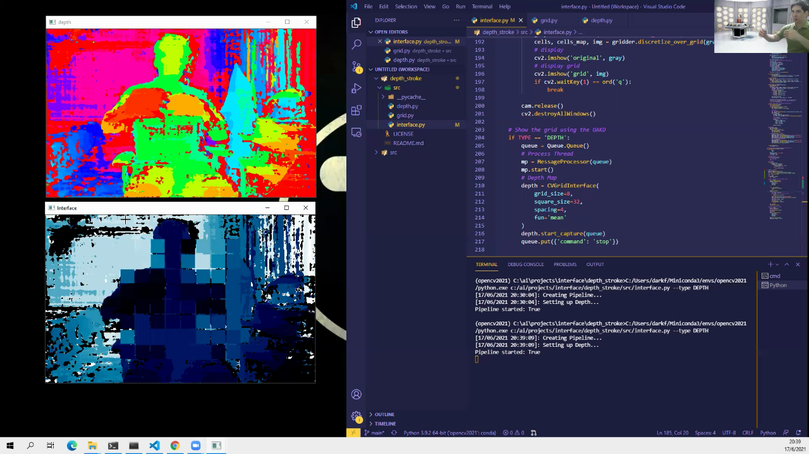

# Depth Stroke
Depth Stroke is an interface for musical interaction, using an OAKD Device from Luxonis

# Purpose
This project tries to explore the posibilities of stereo depth estimation and disparity provided by the OAKD device. For more information on the devices visit Luxonis website [here](https://docs.luxonis.com/en/latest/pages/products/bw1098obc/).

I was inspired by [Eli FIeldsteel](https://music.illinois.edu/faculty/eli-fieldsteel) device that used a grid of photocell conected to microcontrollers and interfacing Supercollider. A video of his performance can be seen [here](https://www.youtube.com/watch?v=k8N0iMYd9H8&ab_channel=EliFieldsteel).

# Experimentation
Currently, I'm working in capturing a depth map from the scene, and discretize in a grid of N by N squares. According to the documentation of the DepthAI API, the depth values are 16 bit raw values (U16) in milimiters, see [here](https://docs.luxonis.com/projects/api/en/latest/components/nodes/stereo_depth/). The depth values in each square are aggregated using a function like ```mean```, (others are provided). This grid of values can be sent to another programs like Supercollider.

&nbsp;

&nbsp;